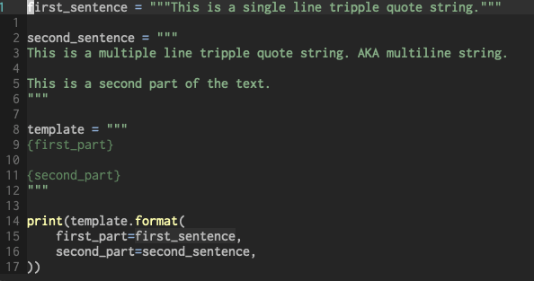

# vim-textobj-multiline-str

This plugin defines a *multiline-str* text object for the [vim-textobj-user](https://github.com/kana/vim-textobj-user) plugin.



# Installing

With [vim-plug](https://github.com/junegunn/vim-plug):

```
Plug 'kana/vim-textobj-user' | Plug 'thalesmello/vim-textobj-multiline-str'
```

# Default mappings 

For Python files:

* `aq`: around multiline string. Gets the string contents and the quotes.
* `im`: inner multiline string. Gets the string contents without the quotes and immediate linebreaks.

# Custom mappings

```
call textobj#user#map('multilinestr', {
      \   'python': {
      \     'select-a': 'a`',
      \     'select-i': 'i`',
      \   }
      \ })

let g:textobj_multilinestr_no_default_key_mappings = 1
```

For more details, look at the [vim-textobj-user documentation](https://github.com/kana/vim-textobj-user/blob/master/doc/textobj-user.txt).
